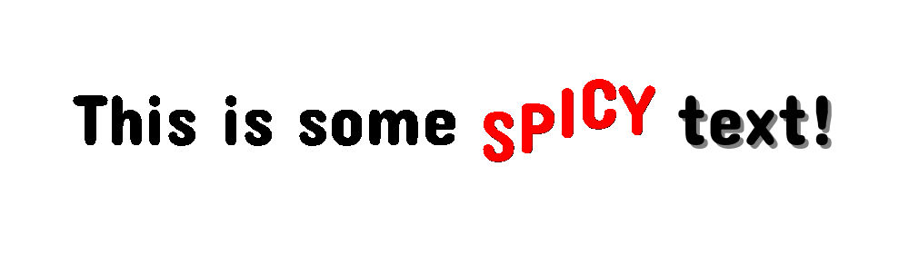

# SpicyText
A simple text effect library for [Processing](https://www.processing.org)

Looking for the [Documentation?](https://www.barneycodes.com/SpicyText/)



### Features:
* Multi-coloured text display
* Text backgrounds
* Text animations and effects
* Text wrapping
* Supports custom fonts and theming
* Supports custom effects

## Basic Usage
By adding some simple tags to a string of text, you can very quickly add inline colours, backgrounds, and animations
to your text!

The GIF above shows the output of the following code:

```java
import com.barneycodes.spicytext.*;

// Declare a SpicyText object
SpicyText mySpicyText;

// Define a string with some tags to add some spice!
String styledText = "This is some [COLOUR=#FFFF0000][EFFECT=BOUNCE]SPICY[END_EFFECT][END_COLOUR] [BACKGROUND=255]text![END_BACKGROUND]";

void setup() {
    size(1280, 720);
    
    // Initialise the Spicy text.
    // It needs a reference to the sketch (this), the text, and a text size (in this case 80).
    mySpicyText = new SpicyText(this, styledText, 80);
}

void draw() {
    background(200);
    
    // Display the text at the given x, y location.
    // You choose how the text is aligned horizontally and vertically.
    // If alignment is omitted, the text will be displayed aligned to the LEFT (horizontally) and TOP (vertically).
    mySpicyText.draw(width/2, height/2, CENTER, CENTER);
}
```

## Tags
You'll notice that the `styledText` has some square brackets (`[]`) in it, containing various text. These are "tags"
that let the Spicy Text know how you want the text to be styled.

There are currently 3 tag types:
1. `[COLOUR=...]` for changing the TEXT colour
2. `[BACKGROUND=...]` for changing the BACKGROUND colour
3. `[EFFECT=...]` for using an effect

Each tag has a corresponding end tag (`[END_COLOUR]`, `[END_BACKGROUND]`, and `[END_EFFECT]`) that let the Spicy Text
know when you want the previous colour/background/effect to end. If there is no end tag, for a given colour/background/effect,
then it will extend until the end of the string.

!!! Note
Any value inside square brackets in the input string will be omitted when being displayed.
Malformed/invalid tags will have no visible impact on the displayed text.

### Colour Tags
Colour tags are used to change the TEXT colour for all characters in between the opening (i.e. `[COLOUR=...]`)
and closing (i.e. `[END_COLOUR]`) tags.

You must specify a colour after the `=` inside the tag. This can take 3 different forms:

1. A simple integer (e.g. `[COLOUR=255]`)
2. A hexadecimal integer using the `0x` format (e.g. `[COLOUR=0xFFFFFFFF]`)
3. A hexadecimal integer using the `#` format (e.g. `[COLOUR=#FFFFFFFF]`)

All of the above examples produce white text.

!!! Note
Processing uses the `ARGB` colour format, so when specifying a colour with hexadecimal, use 8 characters.
If you only use 6 characters (to represent `RGB`), the alpha will be set to 0, meaning your text will be invisible!
To get around this, simply add `FF` to the start of your number (e.g. `0x00FF00` -> `0xFF00FF00` for green) to set the alpha to 100%.
Of course, you can play with this for transparent text too!

### Background Tags
Background tags are used to change the BACKGROUND colour for all characters in between the opening (i.e. `[BACKGROUND=...]`)
and closing (i.e. `[END_BACKGROUND]`) tags.

Just like the `[COLOUR=...]` tags, you must specify a colour after the `=` inside the tag.
All the rules for `[COLOUR=...]` tags also apply for `[BACKGROUND=...]` tags.

### Effect Tags
Effect tags are used to apply animations and other programmatic effects to all the characters in between the opening (i.e. `[EFFECT=...]`)
and closing (i.e. `[END_EFFECT]`) tags.

You must specify the desired effect after the `=` inside the tag. There are currently 3 in-built effects:

1. `[EFFECT=BOUNCE]` to make text bounce
2. `[EFFECT=WAVE]` to make text wave
3. `[EFFECT=JIGGLE]` to make text...that's right, jiggle


### Nesting/Combining Tags
Characters can be influenced by multiple different tags at the same time.

Colours/backgrounds/effects are stored internally in a stack, so an `[END_...]` tag will simply pop the most recently set
colour/background/effect off the stack.


**Colour and background tags:**

In the case of `[COLOUR=...]` and `[BACKGROUND=...]` tags, characters will use the most recently set colour.
When an `[END_COLOUR]` or `[END_BACKGROUND]` tag is found, it will pop the last colour/background from the stack so all
following characters will use the previously set colour/background.

If the stack is already empty, the text will use the colour set in the theme and no background will be displayed.

Try this:

`"Default colour [COLOUR=#FFFF0000]RED [COLOUR=#FF00FF00]GREEN![END_COLOUR] RED again[END_COLOUR] back to default"`


**Effect tags:**

If a character is inside multiple `[EFFECT=...]` tags, the character will be influenced by ALL of the effects in the stack
(as long as any custom effects have been written "correctly" to not write over the output of other effects...).

Try this:

`"No effect [EFFECT=WAVE]WAVING [EFFECT=JIGGLE]WAVING AND JIGGLING[END_EFFECT] WAVING again[END_EFFECT] back to normal"`

**Altogether now!**

Character backgrounds are drawn relative to the final position of the character (after effects are applied), so moving
text will also move the backgrounds.

Try this:

`"Normal [EFFECT=WAVE]WAVING [BACKGROUND=#FFFF0000]WAVING AND RED BACKGROUND[END_BACKGROUND] just waving[END_EFFECT] and back to normal"`


## Processing Libraries
This library was created using the [Processing Library Template](https://github.com/processing/processing-library-template/) created by Claudine Chen ([@mingness](https://github.com/mingness)) as part of the 2024 New Beginnings (pr05) Grant from the 
[Processing Foundation](https://github.com/processing), to simplify the
workflows for libraries, tools, and modes, mentored by Stef Tervelde ([@Stefterv](https://github.com/stefterv)).
