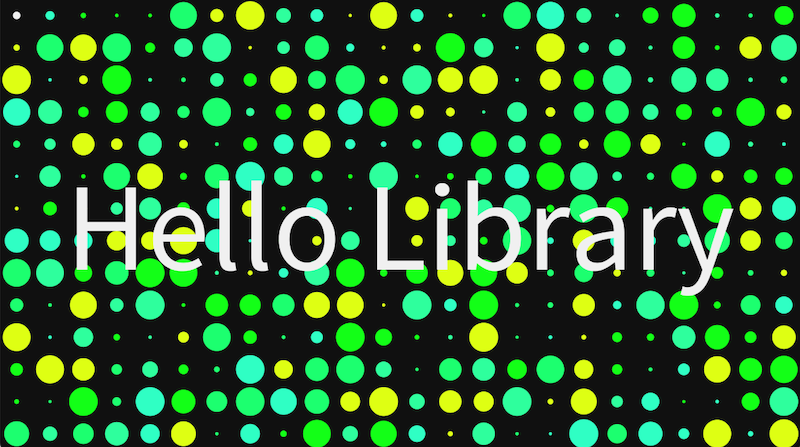

# SpicyText

A simple text effect library for [Processing](https://www.processing.org).

Use the built-in `[COLOUR=...]`, `[BACKGROUND=...]` and `[EFFECT=...]` tags to quickly style and animate your text. Stacking tags lets you get truly creative, and if that's not enough you can also supply your own [CUSTOM effects](custom-effects.md)!

This is an open source library, so check out the code on GitHub at [https://github.com/BarneyWhiteman/SpicyText](https://github.com/BarneyWhiteman/SpicyText) if you're interested!

This documentation provides information on

1. [Getting started](getting-started.md)
2. [Examples](examples.md)
3. [Using Custom Themes](custom-themes)
4. [Creating Custom Effects](custom-effects)
